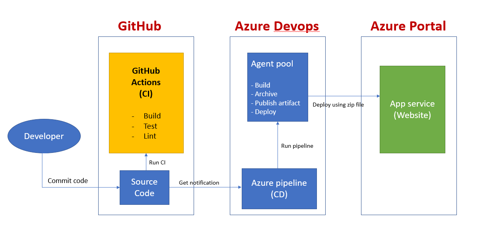
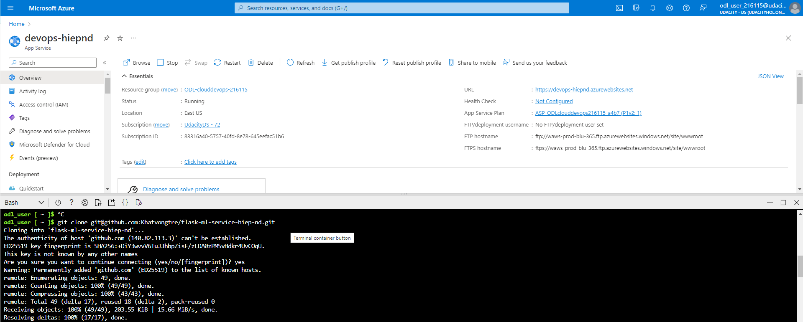
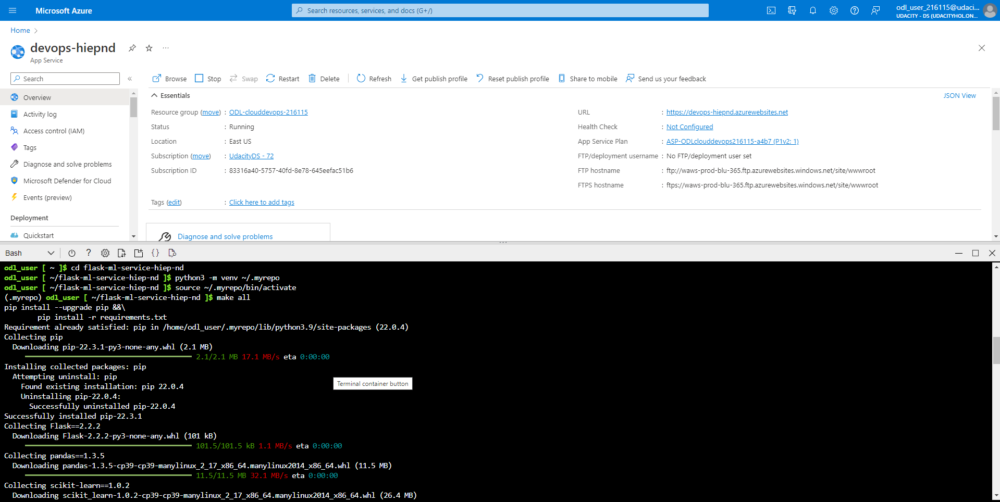
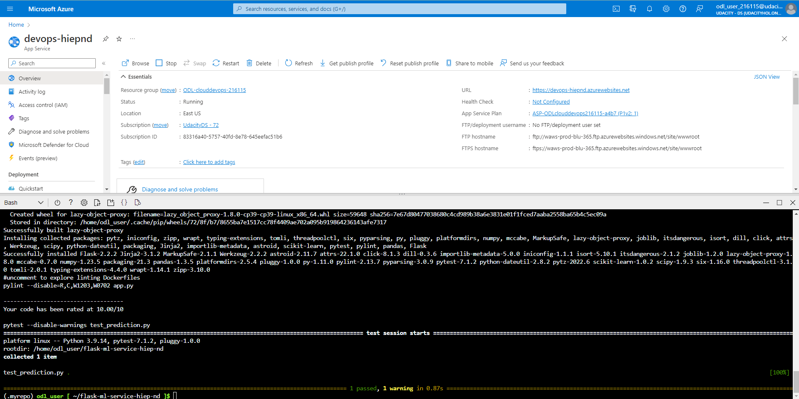
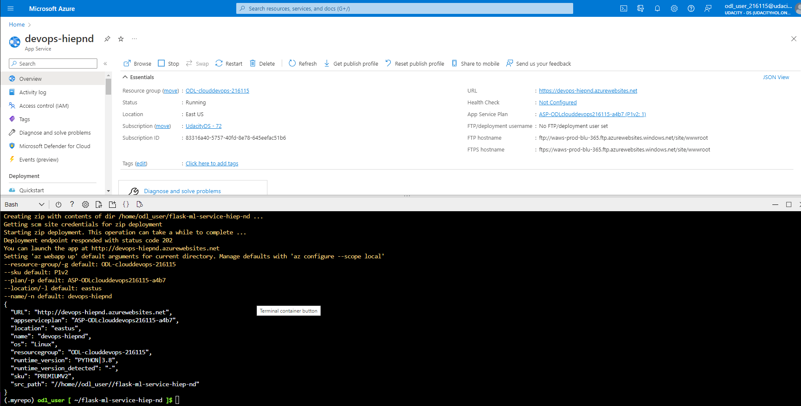
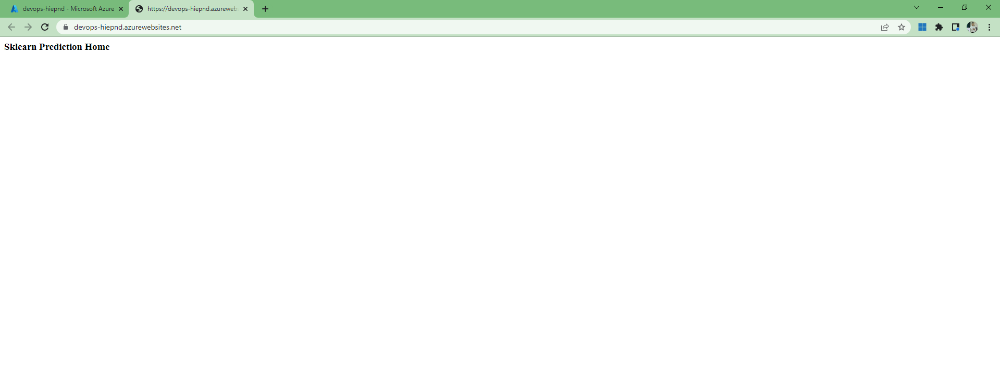
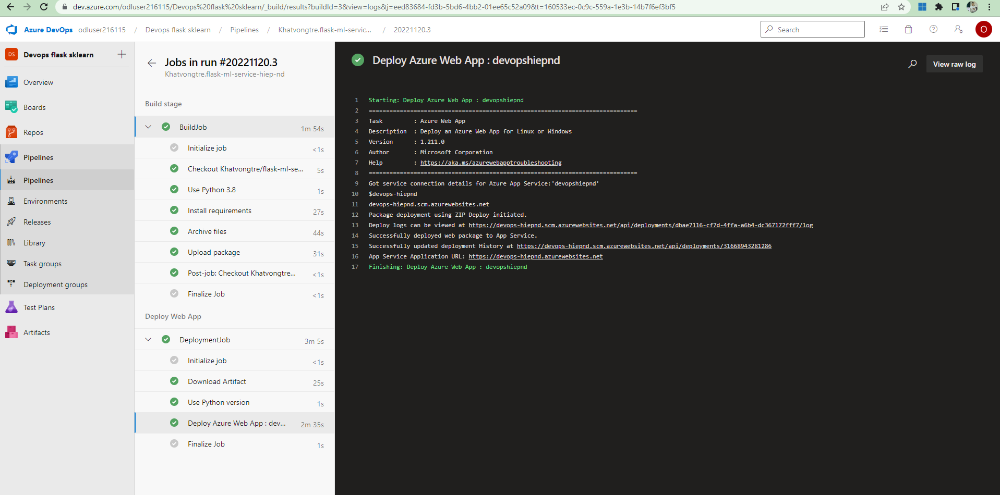
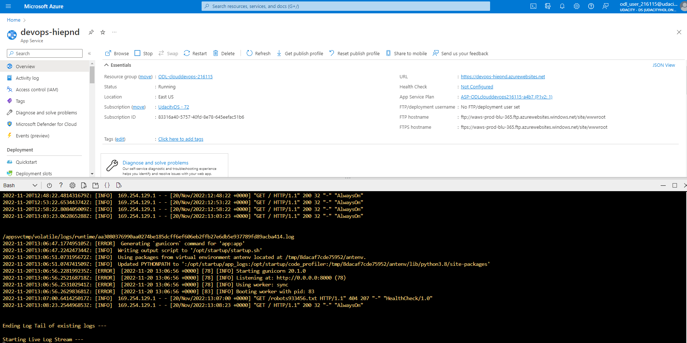

# Overview
This project demonstrate how to manage and devlop a python project using CI/CD with Azure Devops

## Project Plan
* [Trello dashboard](https://trello.com/b/WGNhKyLS/management-task)

* [Spreadsheet](https://drive.google.com/file/d/1Tolvsrtbe1wXDoUyTK_t_mOrshLesx8F/view)

## Instructions

### The architectural Diagram:


### Instructions for running the Python project
#### Project cloned into Azure Cloud Shell and test
* Open Cloud shell using bash and clone project then go to project folder:

`$ git clone https://github.com/Khatvongtre/flask-ml-service-hiep-nd.git`
or

`$ git clone git@github.com:Khatvongtre/flask-ml-service-hiep-nd.git`
`$ cd flask-ml-service-hiep-nd`



* Step testing 
`$ python3 -m venv ~/.myrepo`
`$ source ~/.myrepo/bin/activate`
`$  make all`



* Testing result:
After above step you see dependencies are installed, lint rate 10/10 and tests are passed as below:

#### Project running on Azure App Service

* You can deploy this project direct to azure using command:
`$az webapp up -n "devops-hiepnd" --runtime "PYTHON:3.8"`

And see the result deploy successfully:


Can go to the url and check as well:


Note: The app service was created before.

* Running Azure App Service from Azure Pipelines automatic deployment


* Successful prediction from deployed flask app in Azure Cloud Shell.  [Use this file as a template for the deployed prediction](https://github.com/udacity/nd082-Azure-Cloud-DevOps-Starter-Code/blob/master/C2-AgileDevelopmentwithAzure/project/starter_files/flask-sklearn/make_predict_azure_app.sh).
The output should look similar to this:

```bash
$ make_predict_azure_app.sh
```
If show Permission denied please try this:
```bash
$ chmod 774 make_predict_azure_app.sh
```

Note: I use the **LinearRegression** model, if you use other models the result can be different.

* Output of streamed log files from deployed application
`az webapp log tail -g ODL-clouddevops-216115 -n devops-hiepnd`



## Enhancements

In this project trigger only one branch. Actualy in project will work some branch(dev, staging, pre-prod, prod...)

If you want create resource fast(VM, Network, Disk...) you can:

* Using terraform file
* Create template then can create environment pipelines with ease

So that each environment we have a set of resources and its own pipeline. Developer just merge the code to target branch, pipieline will auto run
